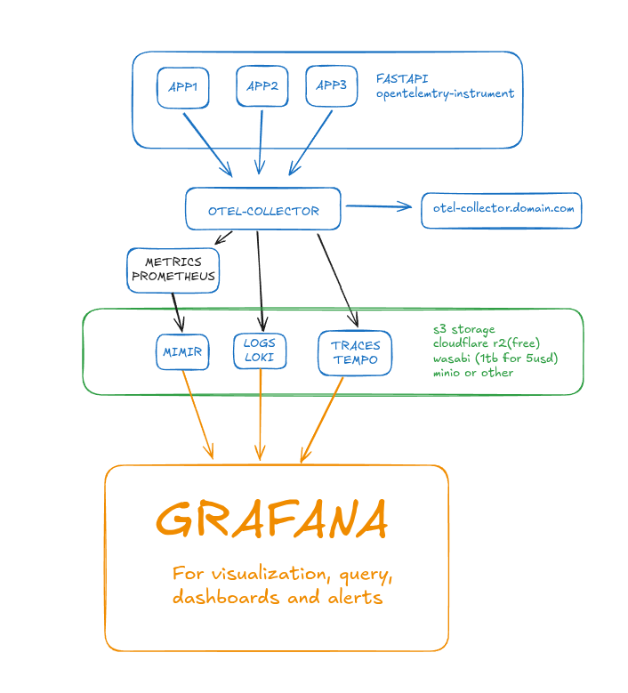

This project was inspired by and references the following works:

- [fastapi-observability](https://github.com/Blueswen/fastapi-observability) – served as the basis for the dashboard and documentation.  
- [opentelemetry-apm](https://github.com/blueswen/opentelemetry-apm) – used to run OpenTelemetry in a practical and structured way.  

Observe your FastAPI application with the pillars of observability on [Grafana-LGTM](https://github.com/grafana/grafana) and [Open-Telemetry](https://opentelemetry.io/docs/zero-code/python/) while easily persist this data on S3 (we recommend [cloudflare-r2](https://www.cloudflare.com/developer-platform/products/r2/), you get free 10GB storage with 1M writes and 10M reads):

1. Traces with [Tempo](https://github.com/grafana/tempo) and [OpenTelemetry Python SDK](https://github.com/open-telemetry/opentelemetry-python)
2. Metrics with [Prometheus](https://prometheus.io/) and [Prometheus Python Client](https://github.com/prometheus/client_python)
3. Logs with [Loki](https://github.com/grafana/loki)
4. Continous profiling with [pyroscope](https://grafana.com/oss/pyroscope/)
5. Metrics persistence at s3 with [Mimir](https://grafana.com/docs/mimir/latest/)(un-complete)



## Configuration Start

1. Setup your .env file (I named mine as stack.env)
```bash
# Loki S3 envs
LOKI_BUCKET_ENDPOINT=${LOKI_BUCKET_ENDPOINT}
LOKI_BUCKET_NAME=${LOKI_BUCKET_NAME}
LOKI_ACCESS_KEY=${LOKI_ACCESS_KEY}
LOKI_SECRET_KEY=${LOKI_SECRET_KEY}
LOKI_RULES_BUCKET_NAME=${LOKI_RULES_BUCKET_NAME}

# Tempo S3 envs
TEMPO_BUCKET_ENDPOINT=${LOKI_BUCKET_ENDPOINT}
TEMPO_BUCKET_NAME=${TEMPO_BUCKET_NAME}
TEMPO_ACCESS_KEY=${LOKI_ACCESS_KEY}
TEMPO_SECRET_KEY=${LOKI_SECRET_KEY}

# Pyroscope S3 envs
PYROSCOPE_BUCKET_ENDPOINT=${LOKI_BUCKET_ENDPOINT}
PYROSCOPE_BUCKET_NAME=${PYROSCOPE_BUCKET_NAME}
PYROSCOPE_ACCESS_KEY=${LOKI_ACCESS_KEY}
PYROSCOPE_SECRET_KEY=${LOKI_SECRET_KEY}

# Mimir S3 envs
MIMIR_BUCKET_ENDPOINT=${LOKI_BUCKET_ENDPOINT}
MIMIR_BUCKET_NAME=${MIMIR_BUCKET_NAME}
MIMIR_ACCESS_KEY=${LOKI_ACCESS_KEY}
MIMIR_SECRET_KEY=${LOKI_SECRET_KEY}
```

2. Start all services with docker-compose

```bash
docker-compose up -d
```

3. You already can send data to your otel-collector at defined port:
```bash
# GRPC - I recommend for internal use
localhost:4317

# HTTP - I recommendo for external user, especially with DNS
localhost:4318

# You can easly expose by pointing a tunnel/vpn/reverse-proxy to otel_colletor_ip:4318
```

4. You can access your grafana at:
```bash
localhost:3005

# You can easly expose by pointing a tunnel/vpn/reverse-proxy to grafana_ip:3005
```

